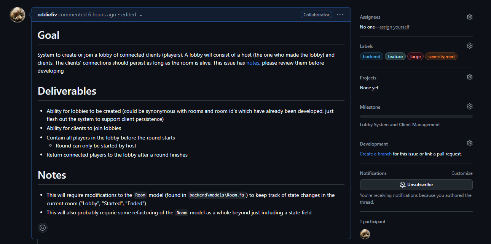
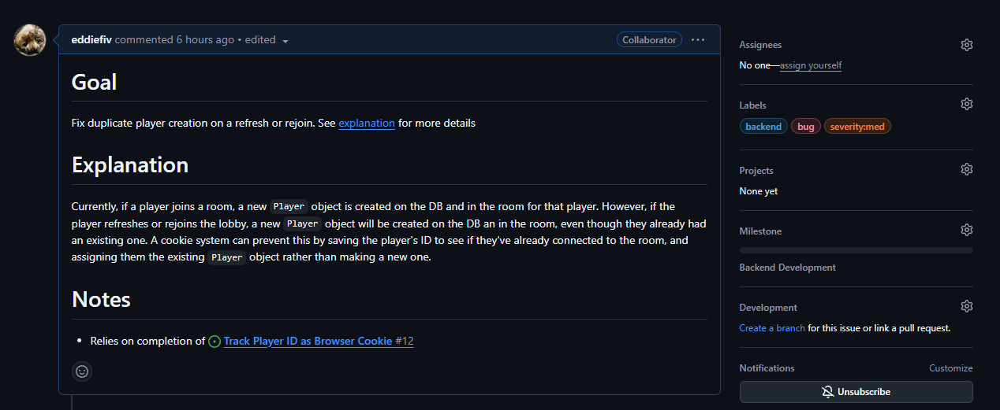

# Word Hunt SWE experience project
Welcome to the Word Hunt SWE experience project! Here we will go over everything you'll need to know to make contributions, as well as understanding a little bit about GitHub contribution essentials. Whether you have little experience with contributing, or need some refreshers, everything you need to know to get started will be stated here in this readme. If something is missing from the readme, feel free to create a [issue/pull request](#reporting-bugs-or-requesting-features) modifying the readme.

While the core components of the project have already been laid out for you as issues, you are encouraged to be creative while developing. With that being said, if you have a genuis idea you want to see added or maybe a bug you encounter while testing or developing (try to fix it yourself), refer to [reporting bugs or requesting features](#reporting-bugs-or-requesting-features).

Furthermore, if you have any questions with anything at all, please feel free to message the slack #word-hunt-project channel, or DM either me (Eddie Falco), Luke Novak, or David Novak. :)

## Table of Contents
Prerequisites (get familiar with these, then continue)
- [Reporting Bugs or Requesting Features](#reporting-bugs-or-requesting-features)
- [Issue Guidelines](#issue-guidelines)
  - [What Are Issues](#what-are-issues)
  - [Issue Structure](#issue-structure)
    - [Feature](#feature)
    - [Bug](#bug)
  - [Issue Labeling](#required-issue-labels)
- [Pull Request Guidelines](#pull-request-guidelines)
  - [Pull Request Structure](#pull-request-structure)
  - [Pull Request Labeling](#required-pull-request-labels)
  - [Linking With Issues](#linking-with-issues)

Getting Started (then start here, at dependencies)
- [Project Dependencies](#dependencies)
- [How to Contribute](#how-to-contribute)
  - [Forking The Repository](#forking-the-repository)
  - [Clone Your Newly Forked Repository](#clone-your-newly-forked-repository)
  - [Setting Up The Development Environment](#setting-up-the-development-environment)
  - [Claiming Issues](#claiming-issues)
  - [Creating Branches](#create-a-branch-on-your-forked-repository)
  - [Make Changes](#make-changes)
  - [Test Changes](#test-your-changes)
  - [Push Changse](#push-changes)
  - [Creating a Pull Request](#create-a-pull-request-on-main-repository-and-merge-changes)
- [Code Execution](#code-execution)
- [Collaboration](#collaboration)

Useful info (if you need clarity)
- [Resolving Conflicts](#resolving-conflicts)
- [Important Git Commands](#important-commands)
  - [Setting Up](#setting-up)
  - [Debugging Git](#debugging-commands)
  - [Branches](#branches)
  - [Fetching and Merging](#fetching-and-merging-pulling)
  - [Committing, Staging, and Pushing](#committing-staging-and-pushing)
  - [Un-doing Changes](#un-doing-changes)


## Reporting Bugs or Requesting Features
If you come across a bug or a feature you'd like to see but don't want to develop it yourself, you are free to create an issue yourself in hopes that someone else may pick it up. If you are able to develop a feature on your own, you can create a pull request with the new code for approval. As usual, if you are to create a pull request and make a contribution, please follow the [contribution guidelines](#contribution-guidelines)

### Creating Issues
Follow the [issue guidelines](#issue-guidelines) below to add an issue

### Creating Pull Requests
Follow the [pull request guidelines](#pull-request-guidelines) below to merge changes

## Issue Guidelines

#### What are issues
Issues are one of the core components of a repository. It is where bugs are reported, features are requested, and questions are asked. This is a crucial step in the contribution process. To view the issues on the repository go to the **Issues** tab under the repository name.

Before contribution to the project, you must figure out where to start developing. This can be done by taking a look through the issues and seeing if any catch your eye. If none do, but you have an idea for the project, you can [make your own issue](#issue-structure) for someone else to work on, or take initiative an make changes yourself. If that is the case, then follow the [contribution guidelines](#how-to-contribute) (still read through the prerequisites first).

However, if you find an issue you think you can work on, then you should comment on the issue with a message like "Claiming this issue" given that nobody else has claimed it yet. Once you claim the issue, you are free to start developing (again, follow the [contribution guidelines](#how-to-contribute) first).

If you are creating an issue, below are the steps to properly make one.

### Issue structure
Each issue should follow a general structure so it is clear what is being conveyed. The structure of the issue will vary depending on whether the issue is a bug or a feature (using proper [labels](#required-labels)). The structures are as follows,

#### Feature
For issues pertaining to features, the content of the issue should contain:
* A **goal** section (required)
  * Describe the reason for the feature request and what its intent is
* A **deliverables** section (required)
  * A bulleted list of individual components that make up the feature. This can be as little as one item, and doesn't have to be anything crazy as long as it contains the parts to make up the full feature
* A **notes** section (optional)
  * A bulleted list of optional notes that can contain any kind of extra messages, info, or whatever else you can think of that feels relevant.

Below is an example of an issue (Lobby System issue) with the proper structure. The format of the structure follows markdown syntax. Each section header is denoted by a # followed by the name of the section (# Goal, # Deliverables, # Notes). Bulleted lists can be denoted by * or -.


#### Bug
For issues pertaining to bugs, the format of the content is a little different:
* A **goal** section (required)
  * A brief description of the reason to fix the bug (literally anything)
* An **explanation** section (required)
  * A comprehensive explanation of what the bug is, why it is an issue, and what solving it would fix
* A **notes** section (optional)
  * Same as before, a bulleted list of anything relevant you can think of that didn't fit in the above sections

Here is an example of a bug fix issue


### Required Issue Labels
Labeling is highly important during issue creation, as it quickly tells others what the issue pertains to. Labels are added in the right panel under **labels**. The labeling rules are as follows:

Each issue must contain only one label from the following:
- `bug` - If the issue pertains to a bug in the code
- `feature` - If the issue pertains to an undeveloped feature

And one OR both from the following:
- `frontend` - If the issue is frontend related
- `backend` - If the issue is backend related

Each issue must also be labeled with a severity level to determine whether an issue is minor or major. Only one of the following labels should be applied to each issue:
- `severity:low` - If the issue is considered inconsequential. Use this for the most minor and trivial bugs or features
- `severity:med` - If the issue is considered important, but not game breaking. This will probably be the most common label for most bugs or features
- `severity:high` - If the issue is game breaking and requires prompt fixing. This will usually only pertain to bugs that break the functionality of a feature

All other labels are optional, and below will list each label and their categories
- **Type of Work**:
  - `bug`
  - `feature`
  - `frontend`
  - `backend`

- **Severity**:
  - `severity:low`
  - `severity:med`
  - `severity:high`

- **Status**:
  - `good first issue` - An issue that is suitable for those with less experience, or just trying to get their feet in the water
  - `large` - For issues that are considered to be a large contribution and might be very complex
  - `question` / `help wanted` - If more attention is needed towards an issue or a question has been asked in relation to said issue
  - `completed` - If an issue is complete and no longer requires development

If you get an output like "v20.18.0", then you are all done. If you do not get an output with a version number, then check back to make sure you installed Node properly, otherwise reinstall and see what happens. If all else fails, please feel free to shoot a message into slack or dm me, luke, or david.

## Pull Request Guidelines
If the content of this section is confusing, it might be helpful to come back to this after you read the [contribution guidelines](#how-to-contribute).

When you want to make changes to the upstream repository (from a branch of your forked repository), you must make a pull reqeust on the upstream repository.

To make a pull request, go to the pull requests tab on the upstream repository and click **New pull request**. You should then be able to select your fork and branch (if you cannot see the option to select a fork, click **compare across forks**).

To merge your branch, leave the base repository and base branch alone as this is the repository which you are merging into, and modify the head repository to be your forked repository and the compare branch to be the feature branch you created. Make sure you are merging the correct feature branch that corresponds to the feature of the pull request you are creating.

### Pull Request Structure
Now, you should title your pull request something relevant to the changes you are attempting to merge. For example, if you are merging the entirety of the backend for the lobby system, you could title the pr "Lobby System Backend".

For the body of the pr, like the issues, you should clearly describe the chagnes being made to the upstream repository. Each pull request should include:

* A **description** section (required)
  * Outline the changes that were made, and a brief overview of the feature.
* A **notes** section (optional)
  * Any extra info you think is relevant to the pr but doesn't fit in the description

### Required Pull Request Labels
When it comes to labeling a pr, it should generally follow the same rules as issue labeling, besides a few other rules. Pull requests utilize the `bug-fix` label instead of the `bug` label for added clarity. The pull request labeling rules are as follows:

Each pull request should contain one of the following labels, but preferably not both:
- `feature` - For pull requests adding features
- `bug-fix` - For pull requests fixing a bug

Each pull request should contain one of the following labels, but prefereably not both (if both, try to split up the pr into a backend code merge and a frontend code merge):
- `backend` - For pull requests pertaining to backend code
- `frontend` - For pull requests pertaining to frontend code

Each pull request should contain only one of the following labels:
- `severity:low` - For a pull request that is minor or trivial, not used often
- `severity:med` - For a pull request that is of moderate impact, most used
- `severity:high` - For a pull request that has a major impact, usually for major bug fixes

### Linking With Issues
If your pull request was a direct response to an issue that you previously claimed, it is best practice to **link** your pull request to the relevant issue. This way, if your pull request is merged the issue that was associated with the pull request will automatically close and will be marked as complete. To do this, go to the **development** section on the right panel and add the relevant issue.

## Dependencies
Before you start, you need to have Node.js (and npm) installed to your machine if not already. If you already have it, you can skip this step.

You can install Node.js [here](https://nodejs.org/en/download/prebuilt-installer). When installing, ensure you install `npm` (this is how you will execute the code during testing, it should be an option in the installer).

When the installer is finished, open a new terminal window and run
```bash
node --version
```

## How to Contribute

### Forking the repository
To begin contributing, you first want to fork the repository to make a working copy of the `main` branch. This can be done by clicking the **Fork** button while on the repository page.

### Clone your newly forked repository
To make changes to the codebase, you must clone the repository. To do so, run this script in your terminal on your local machine
```bash
git clone https://github.com/YOUR_GITHUB_USERNAME/word-hunt.git
```
This command can also be found inside the repository page under the **Code** button. Use HTTPS for cloning, unless you have SSH keys set up on your GitHub account.

### Setting up the development environment
After your repository is on your machine, the first thing you want to do is install all the required Node.js packages (located in `packages.json` in `./`, `./backend`, and `./frontend` respectively). To do so, first open a terminal and make sure you are inside of `word-hunt`. Then run

```bash
npm install
```

Note: if `npm` fails, make sure it was installed during the [Node.js installation](#dependencies).

Next, you want to `cd` into the `./frontend` directory  from `word-hunt`

```bash
cd frontend
```

Run `npm install` again inside, then

```bash
cd ../backend
```

Once again, run `npm install`

Once all three directories have been `npm installed`'d, you are good to move on to the next steps!

### Set the original repository as the `upstream` repository
To be able to pull changes from the original repository, you must configure it as a remote on your local repository
```bash
git remote add upstream https://github.com/davidjnovak/word-hunt
```
After running this, you can run commands like `git fetch upstream` (I'll go over that a little further down)

### Claiming Issues
As mentioned in the [issue guidelines](#issue-guidelines), when you are ready to start developing, you can claim an issue to work on. To do so, navigate to the **Issues** tab, find an issue, comment on it with a message like "Claiming this issue", and begin developing the feature/fixing the bug.

### Create a branch on your forked repository
After claiming a new issue, you must create a new branch for the new feature development. The purpose of creating a branch is to ensure that the changes you make stay isolated in your development environment (branch), and makes [resolving conflicts](#resolving-conflicts) simpler.

To create a new branch, run the following command in your terminal where {feature-name} is the name of the feature you're adding
```bash
git checkout -b feature/{feature-name}
```

To switch to your branch, or to a different one, you can run
```bash
git checkout {branch-name}
```

**NOTE**: It is good practice to periodically pull (fetch and merge) the upstream repository to your forked one to ensure you are up-to-date on your local repository. To do so, make sure you are switched to your feature development branch, and run
```bash
git fetch upstream
```
This will allow you to view changes that were made to the upstream repository, and see what changes will be made to your local one. This will NOT make changes to your local repository. To finalize the pull and make changes, you must run
```bash
git merge upstream/main
```

### Make Changes
After you have made your changes, you must commit them with a clear and meaningful message. You can make multiple commits before pushing, and it is good practice to make commits after every milestone in your development (you finished an important part of your feature, fixed a portion of a bug, etc).
```bash
git add .
git commit -m "Add new feature"
```

### Test Your Changes
It is important to always be debugging and testing your code to make sure everything works as intended, and no unintended bugs occur. Follow the [code execution guidelines](#code-execution) to figure out how to run and test your code.

### Push Changes
Once you are happy with your code, push your commits to your forked repository at the feature branch
```bash
git push origin feature/{feature-name}
```

### Create a Pull Request on Main Repository and Merge Changes
Refer to [pull request guideilnes](#pull-request-guidelines)

## Code Execution
When you are satisfied with your code, or you want to test out your active development, make sure your changes are saved and run these commands.

### 1. Serve the frontend
Inside a terminal at `./frontend`, run:
#### `npm run serve`

### 2. Run the backend service
Inside a terminal at `./backend`, run:
#### `npm run dev`

When the frontend and backend are running, and assuming they are doing so successfully, you can navigate to http://localhost:3000 and view the project relative to your local machine.

To stop execution of either, run hit `Ctrl+C` inside your terminal to interrupt services.

## Collaboration
If you and a group member come across an issue that is too large for only one of you, you can collaborate towards developing the feature together.

To do this, you can follow a similar procedure to [the contribution guidelines](#how-to-contribute), in that one of you will fork the other's forked repository and contribute the same way you would here. The only difference is the person who owns the original fork would have to be the one to make a [PR](#create-a-pull-request-on-main-repository-and-merge-changes).

## Resolving Conflicts
Occasionally, there will be a time where you pull changes from the upstream repository, and one of the changes you pulled contained changes to a file you're working on. This will cause a conflict in the changes between your file and the pulled file, and in order for you to be able to continue making changes and push to the repository, you need to resolve those changes. If you are using Visual Studio Code, it should show you the upstream changes, and the final change on your local branch after the conflicts are resolved. If you are not using VSC or another IDE that supports conflict resolving, you can follow GitHub's [official guide](https://docs.github.com/en/pull-requests/collaborating-with-pull-requests/addressing-merge-conflicts/resolving-a-merge-conflict-using-the-command-line) on resolving conflicts using the terminal.

## Important Commands
Here is a comprehensive list of all the `Git` commands you may need or encounter during development, as well as what they do


### Setting Up
**Clone a repository**: Clones a repository from a HTTPS or SSH url to your current local directory
```bash
git clone {repository-url}
```

### Debugging Commands
**Check current working status**: Shows the status of your working directory and staging area. This will also show you conflicts if ran after a conflicting merge
```bash
git status
```

**Show commit history**: Show the commit history of your forked repository
```bash
git log
```

### Branches
**Create a new branch**: Creates a new feature branch from the main branch
```bash
git checkout -b feature/{feature-name}
```

**Switch to another branch**: Switches the current branch to another branch (given it exists)
```bash
git checkout {branch-name}
```

**Show all branches**: Lists out all the branches you have made, ideally one for each feature you've developed
```bash
git branch
```

### Fetching and Merging (Pulling)
**Fetch changes from upstream repository**: Gets the changes from upstream without applying the changes to your local repository
```bash
git fetch upstream
```

**Merge changes**: After running `git fetch`, this will apply the changes that were fetched to your local repository
```bash
git merge upstream/main
```

### Committing, Staging, and Pushing
**Stage changes**: Takes all the current changes and places them in the staging area. This must be done before committing
```bash
git add .
```
Optionally, you can also run the following to stage specific files
```bash
git add {filename}
```

**Commit staged changes**: Takes the files from the staging area and packages them to a commit with a message
```bash
git commit -m "Commit message"
```

**Push changes**: Takes all commits and pushes it to your local forked repository
```bash
git push origin feature/{feature-name}
```

### Un-doing Changes
**Revert uncommitted changes**: Discard changes that were not yet committed
```bash
git checkout -- {filename}
```

**Reset staged changes**: Unstage changes
```bash
git reset {filename}
```